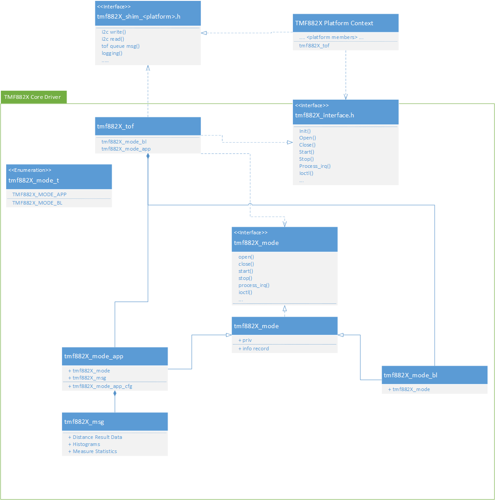
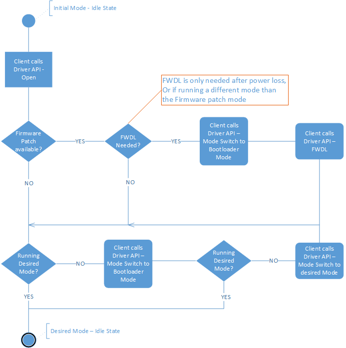
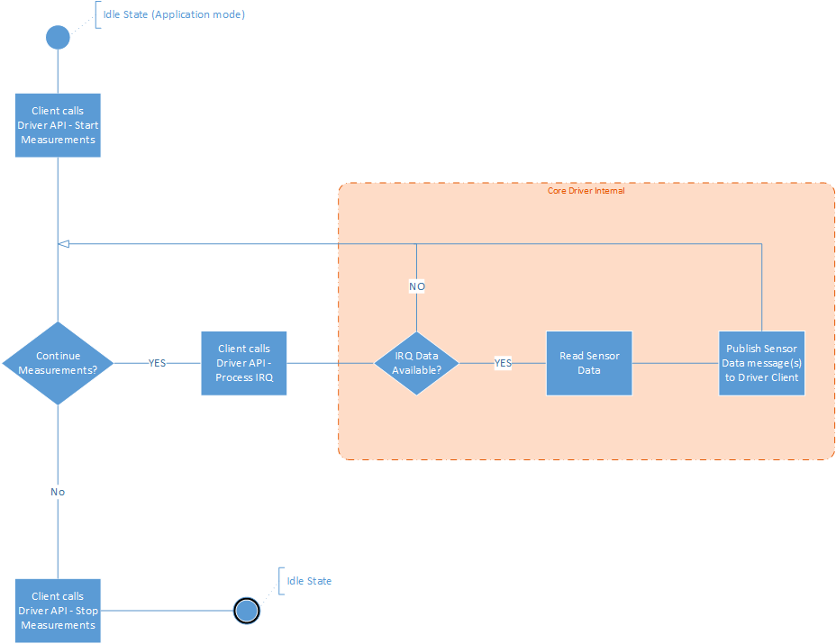
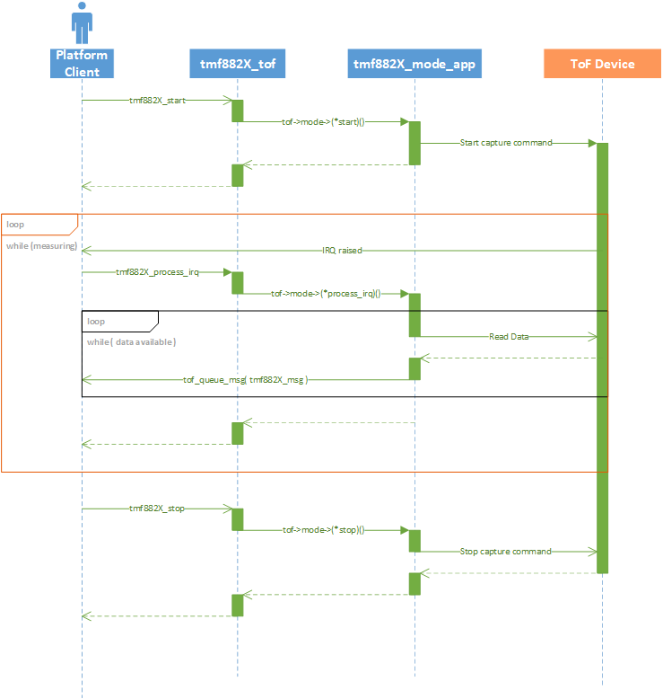

# TMF882X Driver Overview and Architecture

This document describes the baremetal MCU driver for the Time-of-Flight TMF882X
from ams. It is meant to serve as a reference driver using the standard C
library without dependencies on an external framework. The core driver modules
of are documented with Doxygen.

## Core Driver Architecture

The TMF882X driver is designed around a "core" modular style driver with a UNIX-like
interface using common operations like open, close, ioctl, etc. The core driver
client interface is declared in the *tmf882x_interface.h*. The primary structure
used in the core driver interface is the core driver context structure tmf882x_tof.
The tmf882x_tof structure is used as the first parameter in all of the core driver
API functions. The internal definition of the tmf882x_tof structure is exposed in
the *tmf882x_interface.h* so that it can be statically declared by the
client (though it is not required to be statically allocated).

Below are some of the features and design considerations of the core reference driver:

- The core driver is implemented in C99
- The core driver performs no dynamic memory allocation
- All platform specific functions for hardware access, logging, etc. are handled
  through a client-defined callback shim layer
- The core driver has no mutual exclusion mechanisms, and the client must handle
  any synchronization when using the core driver in a multi-threaded application
- The core driver has two log levels, a base level used for informational
  and error logging and a debug level for more verbose logging

Below is an architecture class diagram of the core driver:

@image latex images/TMF882X_driver_class_diagram.png

The core driver operates based on the context of the current operational
"mode", *tmf882x_mode_t*. Not all modes implement all of the available
interface functions defined in *tmf882x_interface.h*, those that are not
implemented/supported return an error.

### Bootloader Mode

The primary purpose of the Bootloader mode is to help load other operational
modes. The mode loading options in the bootloader are currently:

    1. Switch to mode from Non-Volatile Memory
    2. Firmware Download (FWDL) mode

Below is a flowchart diagram of swapping between operational modes with the
core driver interface.

@image latex images/TMF882X_BL_mode_switch_flowchart.png

### Application Mode

The Application mode is the main operational mode of the TMF882X sensor. This
mode is used to perform ToF measurements and return measurement data. The
Application mode only supports switching modes back to the Bootloader
operational mode.

Below is a measurement flowchart diagram in the Application mode with the core
driver interface.

@image latex images/TMF882X_APP_mode_measure_flowchart.png

And here is a sequence diagram of the Application mode measurements and data flow
within the core driver interface.

@image latex images/TMF882X_APP_mode_measurement_sequence_diagram.png

